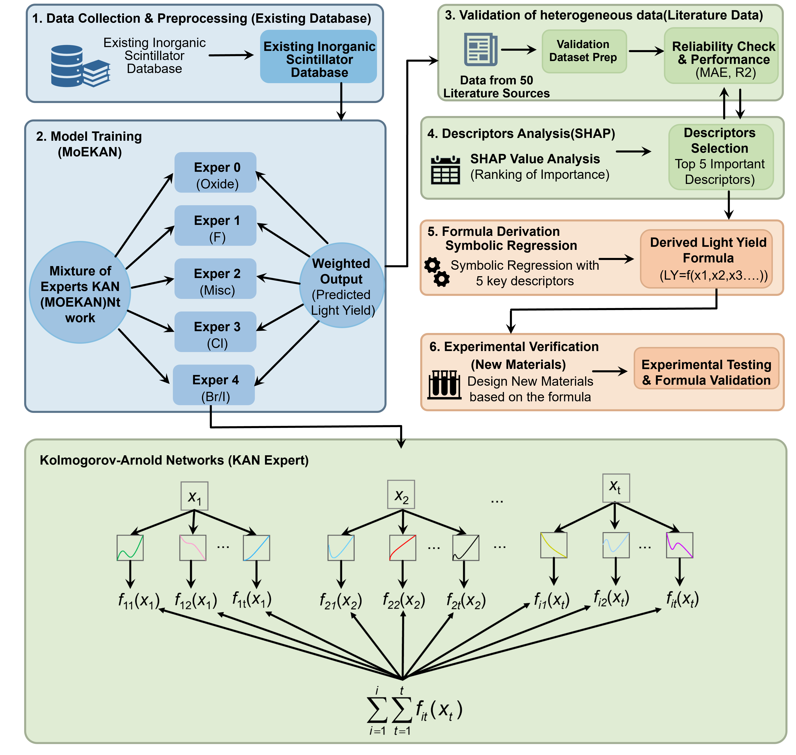

# Mixture-of-experts Kolmogorov-Arnold networks Overcome Small-Data Heterogeneity for Interpretable Inorganic Scintillator Discovery

A Mixture-of-Experts Kolmogorov-Arnold Network (MoE-KAN) framework for predicting material properties from composition descriptors.
The data-driven discovery of inorganic scintillators with high light yield (LY) has been constrained by limited sample sizes and chemical heterogeneity spanning oxides, fluorides, chlorides, and iodides with distinct luminescence mechanisms. Herein, we report the first application of a Mixture-of-Experts Kolmogorov-Arnold Network (MoE-KAN) to materials property prediction, demonstrating that this architecture is naturally adapted to address both challenges. The MoE gating network autonomously partitions 277 Inorganic scintillator compositions into chemically meaningful sub-domains, while the KAN experts achieve effective generalization on sub-domains containing as few as ~50-90 samples per expert. Critically, replacing KAN experts with standard MLP experts with standard MLP experts (MoE-MLP) leads to notable overfitting and substantial degradation in out-of-distribution generalization (blind-testing R2 = 0.431 vs. 0.682 for MoE-KAN), highlighting KAN’s smoothness as an implicit regularizer in data-scarce regimes. Through SHAP analysis and symbolic regression, we further distill an empirical composition–property screening criterion that links LY to the interplay among nuclear effective charge, enthalpy of melting, covalent radius, and mendeleev number. Applying this interpretable framework to the CsCsCl3 system, we identify Mn2+ as the optimal activator and demonstrate, for the first time, its X-ray scintillation performance: CsCaCl3:1%Mn achieves a light yield of 21,577 photons/MeV (~2.6× commercial BGO) with good dose-rate linearity and promising imaging potential. This work demonstrates a scenario-adapted approach for integrating interpretable AI with experimental validation to accelerate materials discovery in data-limited regimes.

## 🚀 Workflow


---

## 🚀 Overview

This project implements a **Mixture-of-Experts (MoE) + Kolmogorov-Arnold Network (KAN)** architecture for regression tasks in materials science.

Key features:

- 🔹 MoE gating mechanism for handling heterogeneous data
- 🔹 KAN-based expert networks for nonlinear representation
- 🔹 Support for tabular material datasets
- 🔹 End-to-end pipeline: training → validation → testing

---

## 🧠 Model Architecture

The model consists of:

- Multiple **KAN-based experts**
- A **gating network** that assigns weights to each expert
- Weighted aggregation of expert outputs

##  ⚙️ Installation
```bash
git clone https://github.com/shiyudongx/MoE-KAN.git
cd MoE-KAN

pip install -r requirements.txt

python main.py
